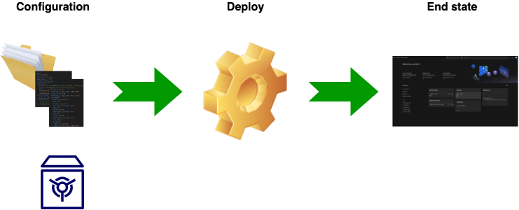
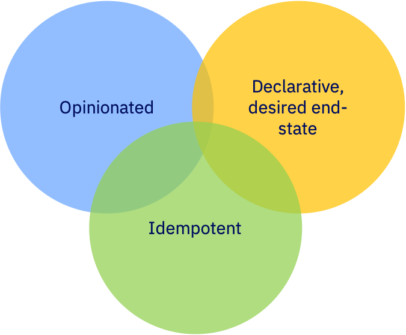

# Cloud Pak Deployer
The intention of the Cloud Pak Deployer is to simplify the initial installation and also continuous management of OpenShift and the Cloud Paks on top of that, driven by automation. It will help you deploy (currently) Cloud Pak for Data on various OpenShift and infrastructures such as IBM Cloud ROKS, Azure Red Hat OpenShift (ARO), Red Hat OpenShift on AWS (ROSA), vSphere and also existing OpenShift.

The Cloud Pak Deployer was created for a joint project with one of our key partners who need to fully automate the deployment of Cloud Pak for Data on IBM Cloud based on a configuration that is kept in a Git repository. As additional needs for the deployed environment surface, the configuration is changed, committed, approved and then changes are deployed without destroying the current environment.

> "If we have seen a screen during deployment, it means something has failed"

Not all Cloud Pak implementations require governance using the previously described GitOps approach. We also wanted to accelerate Cloud Pak deployment for POCs, MVPs and services engagements using the same tool. **Simple by default, flexible when needed**

Cloud Pak Deployer has been designed with the following key principles in mind:

Every deployment starts with a set of configuration files which define the infrastructure, OpenShift cluster and Cloud Pak to be installed. The Cloud Pak Deployer reads the configuration from the specified directory, and secrets which are kept in a vault, and does whatever it needs to do to reach the desired end state. During the deployment, new secrets may be created and these are also stored in the vault. In its simplest form, the vault is a flat file in the specified status directory, but you can also choose to keep the secrets in HashiCorp Vault or the Vault service on IBM Cloud.

.

As long as you keep the configuration directory and the vault available, you can make changes to the config and re-run the deployer to reach the new desired end state. For example, if you choose to add another cartridge to your Cloud Pak for Data deployment, just change the `state` of that cartridge and re-run the deployer.

## Opinionated
Red Hat OpenShift and IBM Cloud Paks offer a wide variety of deployment and configuration options. It is the intention of the Cloud Pak Deployer to simplify the deployment by focusing on proven deployment patterns. As an example: for a non-highly available deployment of the Cloud Pak, we use an NFS storage class; for a production deployment, we use OpenShift Container Storage (aka OpenShift Data Foundation).

Choosing from proven deployment patterns improves the probability for a straightforward installation without surprises.

## Declarative and desired end-state
It is our intention to deploy a combination of OpenShift and Cloud Pak based on a (set of) configuration file(s) that describe the desired end-state. Although the deployment pipeline follows a pre-defined flow, as a user you do not necessarily need to know what happens under the hood. Instead, you have entered the destination (end-state) you want the deployment to have and the deployer will take care of getting you there.

## Idempotent
Idempotence goes hand in hand with the desired end-state principle of the Cloud Pak Deployer. Basically, we're saying: if we make multiple identical requests, we will still arrive at the same end-state, and (very important): if nothing needs to change, don't change. As an example of what that means: say that there was a timeout in the provisioning process because the OpenShift cluster could not be created within the pre-defined timeframe and other resources were successfully created. When the deployer is re-run, it will leave the successfully created resources alone and will not delete or change them, but rather continue the provisioning pipeline.
